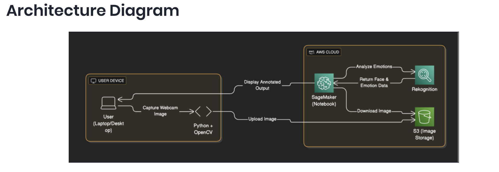

# 😊 Smile Detection from Webcam Images using Amazon Rekognition & SageMaker

**Level:** Intermediate  
**Duration:** 45 Minutes  
**AWS Region:** US East (N. Virginia) – `us-east-1`

## 🛠 Services Used

- Amazon EC2  
- Amazon S3  
- Amazon Rekognition  
- Amazon SageMaker  
- Amazon Web Services (AWS)  
- Generative AI Concepts  

---

# 📌 Lab Details

This hands-on lab guides you through building a **real-time smile and emotion detection system** using **Amazon Rekognition**, integrated within a **Jupyter Notebook hosted on Amazon SageMaker**.

In this lab, you will:

1. Capture a live webcam image using Python.
2. Upload the captured image to Amazon S3.
3. Analyze the image using Amazon Rekognition’s Face Detection API.
4. Display smile status and detected emotions with confidence scores.
5. Annotate the image with bounding boxes and results.

This beginner-friendly lab demonstrates how to build a **serverless AI workflow using AWS services** — without training any custom machine learning models.

---

# 🚀 Introduction

## 🔎 Amazon Rekognition

Amazon Rekognition is a deep learning–based image and video analysis service by AWS. It enables developers to detect:

- Faces  
- Facial emotions  
- Smile detection  
- Objects  
- Text in images  
- Unsafe content  

— all **without building or training custom ML models**.

### In This Lab

Rekognition is used to:

- Detect human faces in a webcam image  
- Determine whether the person is smiling  
- Identify dominant facial emotions such as:
  - Happy  
  - Sad  
  - Angry  
  - Calm  
  - Surprised  
  - Confused  

Each detection includes a **confidence score**, indicating prediction accuracy.

---

## 🗂 Amazon S3 (Simple Storage Service)

Amazon S3 is a secure, scalable object storage service used to store and retrieve files (objects).

### Role in This Project

- Stores the webcam image captured using Python and OpenCV  
- Acts as the storage layer between your local application and AWS services  
- Allows Amazon Rekognition to directly access the uploaded image  

Workflow:
1. Capture image locally  
2. Upload to S3 bucket  
3. Rekognition analyzes image from S3  

---

## 🧠 Amazon SageMaker

Amazon SageMaker is a fully managed machine learning service that provides tools to build, train, and deploy ML models at scale.

### How SageMaker Is Used in This Lab

Although no model training occurs in this lab, SageMaker provides:

- A hosted **Jupyter Notebook environment**
- Cloud-based execution of Python code
- Integration with AWS services

Inside SageMaker, you will:

- Write image capture and processing code  
- Upload images to S3  
- Call the Rekognition API  
- Display annotated results using:
  - Pillow (PIL)
  - Matplotlib  

SageMaker acts as a **centralized cloud-native AI development environment** without requiring local ML setup.

---

# 🏗 Architecture Overview

### Step-by-Step Workflow

1. 📷 Capture webcam image using Python (OpenCV)
2. ☁ Upload image to Amazon S3
3. 🤖 Amazon Rekognition analyzes the image
4. 📊 Results returned with:
   - Smile status
   - Emotions
   - Confidence scores
5. 🖼 Annotated image displayed in SageMaker Notebook

   

---

# 🎯 Learning Outcomes

By completing this lab, you will:

- Understand how to use pre-trained AI services in AWS
- Build a serverless computer vision workflow
- Integrate S3, Rekognition, and SageMaker
- Work with AWS SDK (boto3) in Python
- Visualize AI predictions with bounding boxes and labels

---

# 💡 Key Takeaway

This lab demonstrates how powerful AWS AI services are — allowing you to implement advanced facial analysis without training or managing infrastructure.

You focus on the application logic.  
AWS handles the deep learning models behind the scenes.

---

## 📌 End Result

A real-time smile and emotion detection system powered entirely by managed AWS services.
